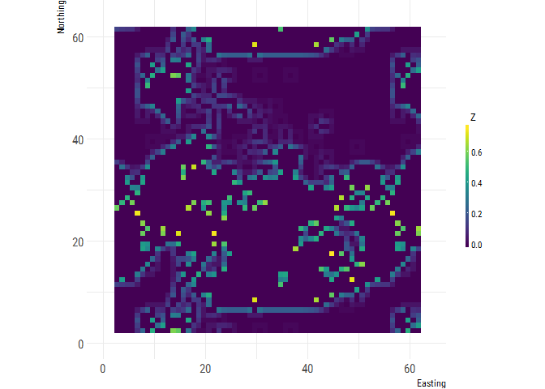

The libraries used can all be installed using `install.packages()` except for winmoveR which should be installed from my github repo using `devtools::install_github("laurajanegraham/winmoveR")` (NB `devtools` will need to be installed to do this). 

## Generate a landscape

This will be a binary landscape of natural and cultivated cells. The example here is 50% cultivated (=0), 50% natural (=1) with moderate spatial autocorrelation (fractal dimension = 0.5). It is in this section of code that we can simulate different kinds of landscapes. 


```r
ls <- nlm_fbm(50, 50, fract_dim = 0.5) %>% 
  util_classify(weighting = c(0.5, 0.5))
util_plot(ls, discrete = TRUE)
```

<!-- -->

To avoid edge effects, we will pad the raster by the largest radius (in this case 7, for a 15 x 15 window) creating the effect of a torus. 


```r
ls_pad <- create_torus(ls, 7)
util_plot(ls_pad, discrete = TRUE)
```

<!-- -->

## Calculate pollinator abundance

Here, this will be the proportion of natural habitat within a 3 x 3 square moving window (radius 1). For each cell, pollinator abundance ($PA_k$) is calculated as follows:

$PA_k = p_{1,3,k} * p_{1, 1, k}$

Where $p_{i, j, k}$ is the proportion of land cover $i$ in a window of size $j*j$ around cell $k$. 

The landscape-scale $PA$ is the mean of all $PA_k$


```r
poll_abund <- winmove_nbrhd(ls_pad, radius = 1, type = "rectangle", fn = "prop", lc_class = 1) * (ls_pad == 1)
util_plot(poll_abund)
```

<!-- -->

```r
# get the landscape value for the service
# 1. get rid of the outer cells
poll_abund_ls <- crop(poll_abund, extent(0 + 7, dim(ls)[1] + 7, 0 + 7, dim(ls)[2] + 7))
# 2. calculate ls mean
poll_abund_mean <- mean(as.vector(poll_abund_ls), na.rm=TRUE)
```

# Calculate crop production

Crop production depends on the pollinator abundance within a 3 x 3 square moving window (radius 1) of a cultivated cell. For each cell, crop production ($CP_k$) is calculated as follows:

$CP_k = \bar{{PA}}_{3,k} * p_{0, 1, k}$

where $\bar{{PA}}_{3,k}$ is the mean value of $PA$ within a 3 x 3 window of $k$. 

Again, landscape scale $CP$ is the mean of all $CP_k$


```r
crop_prod <- winmove_nbrhd(poll_abund, radius = 1, type = "rectangle", fn = "mean") * (ls_pad == 0)
util_plot(crop_prod)
```

<!-- -->

```r
# get the landscape value for the service
# 1. get rid of the outer cells
crop_prod_ls <- crop(crop_prod, extent(0 + 7, dim(ls)[1] + 7, 0 + 7, dim(ls)[2] + 7))
# 2. calculate ls mean
crop_prod_mean <- mean(as.vector(crop_prod_ls), na.rm=TRUE)
```

# Calculate recreation potential

Recreation potential is calculated as the Shannon evenness ($E$) of land-cover types within a window of size 15 x 15 (radius 7):

$RP_k = E_{15, k}$

$E$ is calculated using $E = \frac{-\sum_i p_i * \ln{p_i}}{LC}$ where $p_i$ is the proportion of land cover $i$ as above; $LC$ is the total number of land covers. 

Again, landscape scale $RP$ is the mean of all $RP_k$


```r
rec_pot <- winmove_nbrhd(ls_pad, radius = 7, type = "rectangle", fn = "diversity", lc_class = c(0, 1))
util_plot(rec_pot)
```

<!-- -->

```r
# get the landscape value for the service
# 1. get rid of the outer cells
rec_pot_ls <- crop(rec_pot, extent(0 + 7, dim(ls)[1] + 7, 0 + 7, dim(ls)[2] + 7))
# 2. calculate ls mean
rec_pot_mean <- mean(as.vector(rec_pot_ls), na.rm=TRUE)
```

# Results

We have service landscapes which look as follows: 


```r
util_facetplot(list(`Pollinator abundance` = poll_abund_ls, 
                    `Crop production` = crop_prod_ls, 
                    `Recreation potential` = rec_pot_ls))
```

<!-- -->


However, we would focus on the landscape-scale mean values: 


```r
tibble(Service = c("Crop production", "Pollinator abundance", "Recreation potential"),
              Value = c(crop_prod_mean, poll_abund_mean, rec_pot_mean)) %>% kable
```


Service                     Value
---------------------  ----------
Crop production         0.0547852
Pollinator abundance    0.3940000
Recreation potential    0.8494922

NB For the simulation version of this, I created 100 replicates of landscapes with varying levels of % natural cover and spatial autocorrelation. The final mean values attained for each service were normalised between 0 and 1 so that each were on the same scale. 
